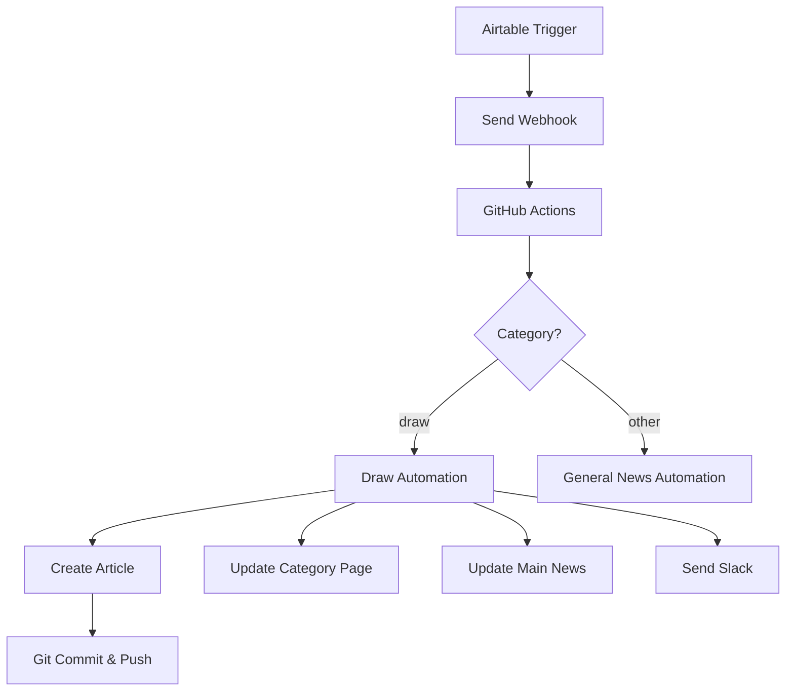

# 📰 News Automation System Guide

## 🎯 Overview

The ImmiWatch News Automation System enables automatic creation and publication of news articles from Airtable data. Currently, the system fully supports **draw** articles with category-specific templates and intelligent content generation.

## 🏗️ System Architecture

```
Airtable → GitHub Repository Dispatch → GitHub Actions → Article Creation → Website Update → Slack Notification
```

### Components

1. **Airtable Script** (`scripts/airtable_news_simple.js`)
   - Extracts news data from Airtable
   - Maps categories to internal system names
   - Sends webhook to GitHub

2. **GitHub Actions Workflow** (`.github/workflows/news_automation.yml`)
   - Receives repository dispatch events
   - Routes to appropriate automation script
   - Handles Git operations and permissions

3. **Draw Automation Script** (`scripts/draw_automation.py`)
   - Processes draw-specific data
   - Generates AI-like analysis
   - Creates article from template
   - Updates category and main pages

4. **Draw Template** (`scripts/draw_news_template.html`)
   - Gold standard template for draw articles
   - Dynamic content placeholders
   - Professional design and SEO optimization

## 📊 Data Flow

### 1. Airtable Configuration

Required fields for draw articles:
- **Headline**: Article title
- **Summary**: Brief description
- **Date of Update**: Publication date (YYYY-MM-DD)
- **Category**: "Invitation Round" (maps to "draw")
- **Impact**: High/Moderate/Low
- **Invitation**: Number of ITAs (for draws)
- **Cutoff**: CRS score (for draws)
- **Draw Type**: CEC/PNP/General/Health/FSTP
- **Source**: Default "IRCC Official"
- **Source URL**: Optional reference link

### 2. Category Mapping

Airtable categories are mapped to internal system categories:

| Airtable Category | System Category |
|-------------------|-----------------|
| Invitation Round  | draw           |
| Policy Update     | policy         |
| Program Delivery Update | program-delivery |
| ATIP Insights     | atip-insights  |
| Legal Decision    | legal          |
| System Notice     | systems        |
| Scam Alert        | scam-alerts    |

### 3. Automation Workflow



## 🚀 Setup Instructions

### 1. GitHub Repository Setup

#### Add Secrets
1. Go to Settings → Secrets and variables → Actions
2. Add `SLACK_WEBHOOK_URL` (optional for notifications)

#### Enable GitHub Actions
- Ensure Actions are enabled in repository settings
- Workflow has `contents: write` permission

### 2. Airtable Automation Setup

1. Create new automation in Airtable
2. Trigger: When record matches conditions
3. Action: Run script
4. Copy contents of `scripts/airtable_news_simple.js`
5. Update configuration:
   ```javascript
   const GITHUB_TOKEN = 'your_github_pat';
   const GITHUB_OWNER = 'your_github_username';
   const GITHUB_REPO = 'immiwatch';
   ```

### 3. Test the System

1. Create test record in Airtable
2. Run automation manually
3. Check GitHub Actions for workflow run
4. Verify article creation

## 📝 Article Creation Process

### Draw Articles

1. **Data Analysis**
   - Extracts ITAs, CRS, draw type
   - Determines impact level
   - Generates strategic insights

2. **Content Generation**
   - Executive summary
   - Quick facts
   - User impact analysis
   - Next steps recommendations

3. **Page Updates**
   - Creates article at `/news/daily/draws/[date]/[slug]/`
   - Adds card to `/news/daily/draws/` category page
   - Updates Latest News on `/news/daily/`
   - Maintains 3 most recent articles
   - Increments category count

## 🔧 Maintenance

### Adding New Templates

1. Create template in `scripts/[category]_news_template.html`
2. Create automation script `scripts/[category]_automation.py`
3. Update workflow routing in `.github/workflows/news_automation.yml`
4. Document in this guide

### Troubleshooting

| Issue | Solution |
|-------|----------|
| Workflow not triggering | Check GitHub PAT permissions |
| Article not created | Check GitHub Actions logs |
| Wrong placement | Verify template paths |
| Slack not sending | Check SLACK_WEBHOOK_URL secret |

## 📄 Current Status

### ✅ Fully Implemented
- Draw articles automation
- Airtable integration
- GitHub Actions workflow
- Category page updates
- Latest News maintenance
- Slack notifications

### 🚧 Pending Implementation
- Policy articles template
- Legal decisions template
- System notices template
- Other category templates
- Weekly digest automation

## 🔗 Related Documentation

- [News System Guide](NEWS_SYSTEM_GUIDE.md) - Overall news architecture
- [Draw Template Guide](../scripts/DRAW_TEMPLATE_GUIDE.md) - Draw template variables
- [Airtable Integration Guide](AIRTABLE_INTEGRATION_GUIDE.md) - Airtable setup details

---

*Last Updated: August 2025*